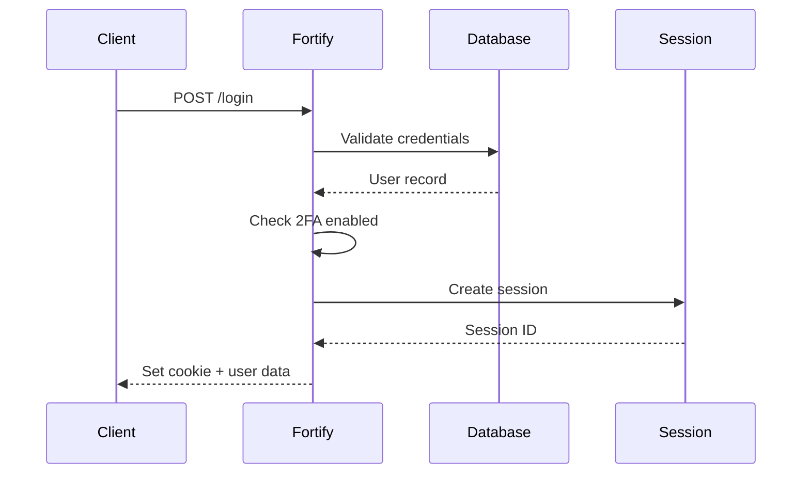

# Backend Architecture

## Service Architecture

### Controller Organization
```
backend/
├── app/
│   ├── Http/
│   │   ├── Controllers/
│   │   │   ├── Api/
│   │   │   │   ├── AuthController.php
│   │   │   │   ├── TaskController.php
│   │   │   │   ├── TeamController.php
│   │   │   │   └── BillingController.php
│   │   │   └── External/
│   │   │       └── ApiTaskController.php
│   │   ├── Middleware/
│   │   │   ├── ApiKeyAuth.php
│   │   │   └── TeamContext.php
│   │   └── Resources/
│   │       ├── TaskResource.php
│   │       └── TeamResource.php
│   ├── Models/
│   ├── Services/
│   └── Policies/
```

### Controller Template
```php
<?php

namespace App\Http\Controllers\Api;

use App\Http\Controllers\Controller;
use App\Http\Requests\TaskRequest;
use App\Http\Resources\TaskResource;
use App\Models\Task;
use App\Services\TaskService;
use Illuminate\Http\Request;

class TaskController extends Controller
{
    public function __construct(
        private TaskService $taskService
    ) {}

    public function index(Request $request)
    {
        $tasks = $this->taskService->getFilteredTasks(
            $request->user()->currentTeam,
            $request->validated()
        );

        return TaskResource::collection($tasks);
    }

    public function store(TaskRequest $request)
    {
        $task = $this->taskService->createTask(
            $request->user()->currentTeam,
            $request->validated()
        );

        return new TaskResource($task);
    }
}
```

## Database Architecture

### Data Access Layer
```php
<?php

namespace App\Repositories;

use App\Models\Task;
use App\Models\Team;
use Illuminate\Support\Collection;
use Illuminate\Support\Facades\Cache;

class TaskRepository
{
    public function getTeamTasks(Team $team, array $filters = []): Collection
    {
        $cacheKey = "tasks.team.{$team->id}." . md5(serialize($filters));
        
        return Cache::remember($cacheKey, 300, function () use ($team, $filters) {
            $query = Task::where('team_id', $team->id);
            
            if (isset($filters['status'])) {
                $query->where('status', $filters['status']);
            }
            
            if (isset($filters['priority'])) {
                $query->where('priority', $filters['priority']);
            }
            
            return $query->with('user')
                ->orderBy('due_date')
                ->paginate(20);
        });
    }
    
    public function createTask(Team $team, array $data): Task
    {
        $task = $team->tasks()->create($data);
        
        Cache::tags(["team.{$team->id}"])->flush();
        
        return $task->fresh();
    }
}
```

## Authentication and Authorization

### Auth Flow


### Middleware/Guards
```php
<?php

namespace App\Http\Middleware;

use Closure;
use Illuminate\Http\Request;

class ApiKeyAuth
{
    public function handle(Request $request, Closure $next)
    {
        $apiKey = $request->header('X-API-Key');
        
        if (!$apiKey) {
            return response()->json(['error' => 'API key required'], 401);
        }
        
        $key = ApiKey::where('key', $apiKey)
            ->where('expires_at', '>', now())
            ->first();
            
        if (!$key) {
            return response()->json(['error' => 'Invalid API key'], 401);
        }
        
        $key->update(['last_used_at' => now()]);
        
        // Track usage
        ApiKeyUsage::create([
            'api_key_id' => $key->id,
            'endpoint' => $request->path(),
            'method' => $request->method(),
            'ip_address' => $request->ip(),
        ]);
        
        $request->merge(['team' => $key->team]);
        
        return $next($request);
    }
}
```

---
