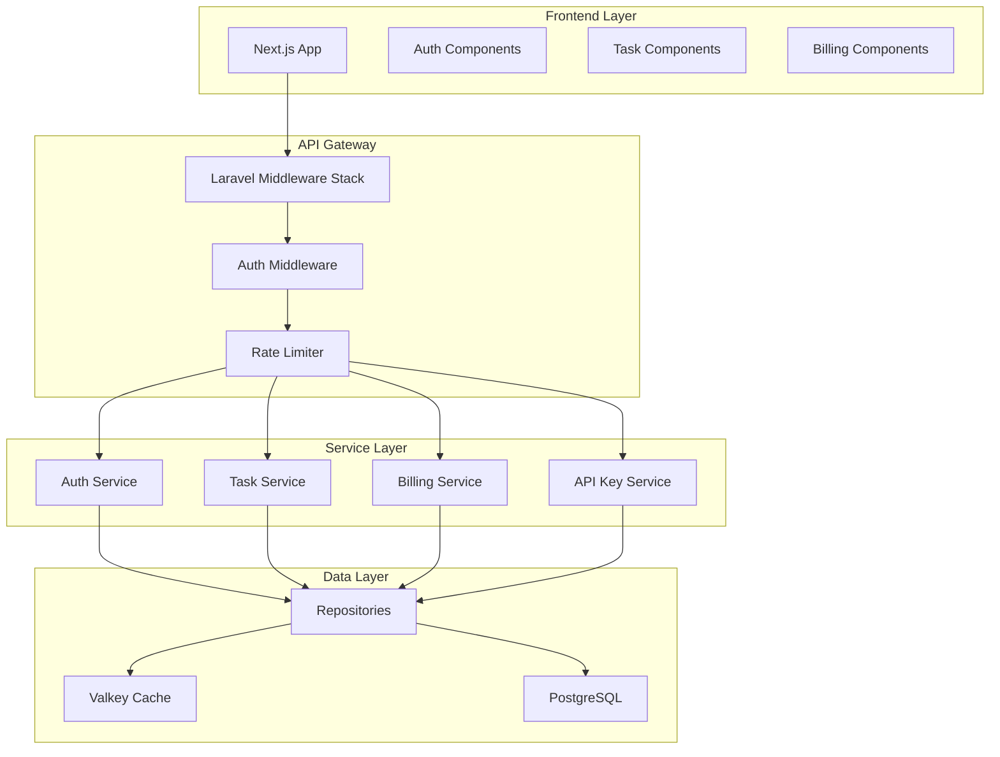

# Components

## Authentication Service
**Responsibility:** Handle all authentication flows including email/password, OAuth, 2FA, and API keys

**Key Interfaces:**
- POST /auth/register - User registration
- POST /auth/login - Session authentication
- POST /auth/oauth/{provider} - OAuth flow
- POST /auth/2fa/verify - 2FA verification

**Dependencies:** Laravel Fortify, NextAuth.js, Laravel Socialite

**Technology Stack:** PHP 8.3, Laravel Fortify for backend, NextAuth.js for frontend OAuth

## Task Management Service
**Responsibility:** Core CRUD operations for tasks with team context and permissions

**Key Interfaces:**
- TaskRepository - Data access layer
- TaskPolicy - Authorization rules
- TaskResource - API response formatting
- TaskController - HTTP endpoint handling

**Dependencies:** Team Service, User Service, Cache Service

**Technology Stack:** Laravel Eloquent ORM, PostgreSQL, Valkey cache

## Subscription Service
**Responsibility:** Handle billing, subscriptions, and feature gating

**Key Interfaces:**
- SubscriptionController - Plan management endpoints
- BillingService - Stripe integration logic
- FeatureGate - Feature availability checks

**Dependencies:** Laravel Cashier, Stripe API

**Technology Stack:** Laravel Cashier, Stripe SDK, Webhook handlers

## API Key Service
**Responsibility:** Generate, validate, and track API key usage

**Key Interfaces:**
- ApiKeyController - Key management endpoints
- ApiKeyMiddleware - Authentication middleware
- UsageTracker - Request logging service

**Dependencies:** Team Service, Rate Limiter

**Technology Stack:** Laravel middleware, PostgreSQL JSONB for scopes

## Frontend API Client
**Responsibility:** Centralized API communication layer for Next.js

**Key Interfaces:**
- ApiClient - Axios instance with interceptors
- useAuth - Authentication hook
- useQuery - Data fetching with React Query

**Dependencies:** Axios, React Query, NextAuth.js

**Technology Stack:** TypeScript, Axios, TanStack Query v5

## Component Diagram

---
