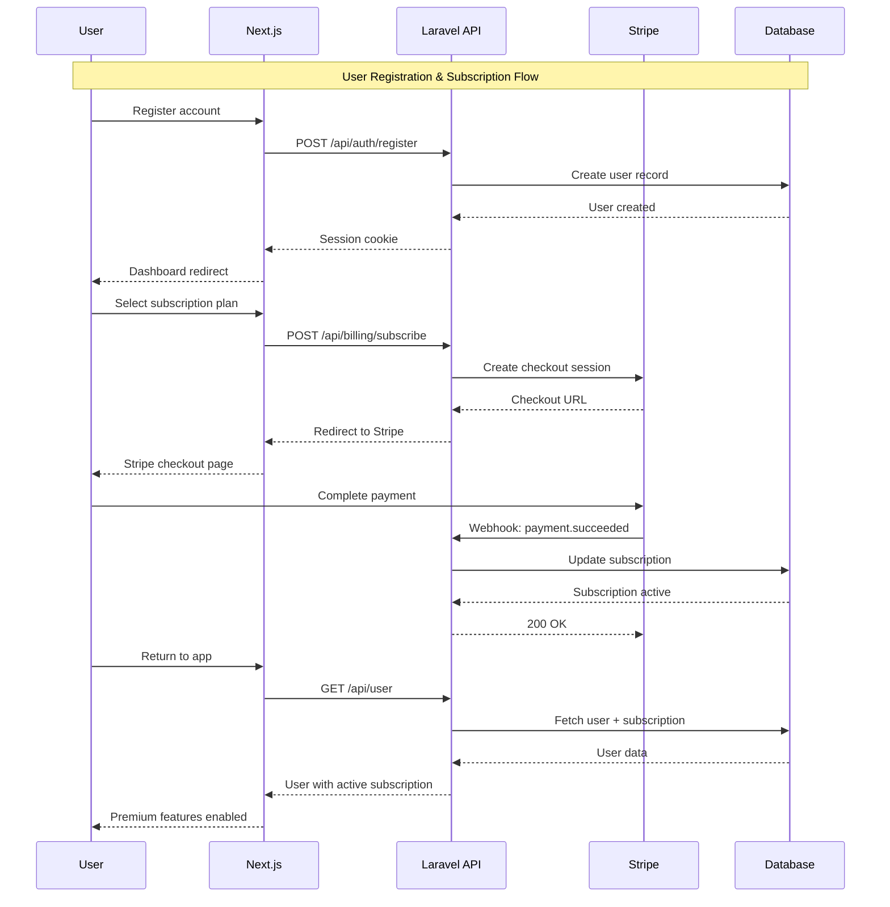
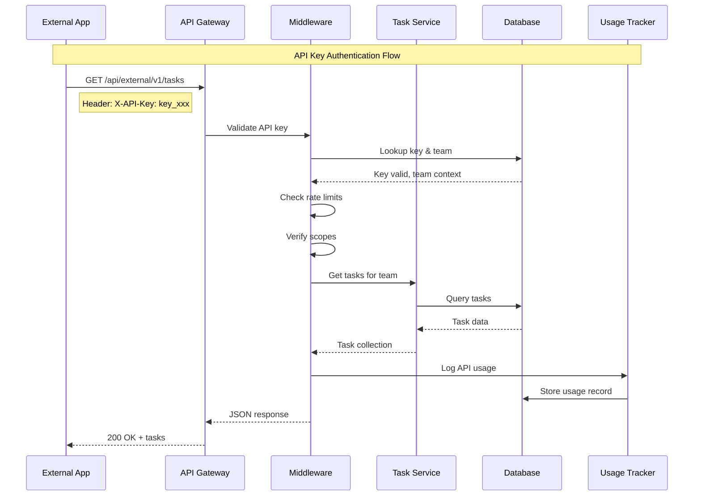

# Core Workflows

```mermaid
sequenceDiagram
    participant U as User
    participant N as Next.js
    participant L as Laravel API
    participant S as Stripe
    participant D as Database
    
    Note over U,D: User Registration & Subscription Flow
    
    U->>N: Register account
    N->>L: POST /api/auth/register
    L->>D: Create user record
    D-->>L: User created
    L-->>N: Session cookie
    N-->>U: Dashboard redirect
    
    U->>N: Select subscription plan
    N->>L: POST /api/billing/subscribe
    L->>S: Create checkout session
    S-->>L: Checkout URL
    L-->>N: Redirect to Stripe
    N-->>U: Stripe checkout page
    
    U->>S: Complete payment
    S->>L: Webhook: payment.succeeded
    L->>D: Update subscription
    D-->>L: Subscription active
    L-->>S: 200 OK
    
    U->>N: Return to app
    N->>L: GET /api/user
    L->>D: Fetch user + subscription
    D-->>L: User data
    L-->>N: User with active subscription
    N-->>U: Premium features enabled
```

```mermaid
sequenceDiagram
    participant E as External App
    participant A as API Gateway
    participant M as Middleware
    participant T as Task Service
    participant D as Database
    participant U as Usage Tracker
    
    Note over E,U: API Key Authentication Flow
    
    E->>A: GET /api/external/v1/tasks
    Note right of E: Header: X-API-Key: key_xxx
    
    A->>M: Validate API key
    M->>D: Lookup key & team
    D-->>M: Key valid, team context
    
    M->>M: Check rate limits
    M->>M: Verify scopes
    
    M->>T: Get tasks for team
    T->>D: Query tasks
    D-->>T: Task data
    
    T-->>M: Task collection
    M->>U: Log API usage
    U->>D: Store usage record
    
    M-->>A: JSON response
    A-->>E: 200 OK + tasks
```

---
