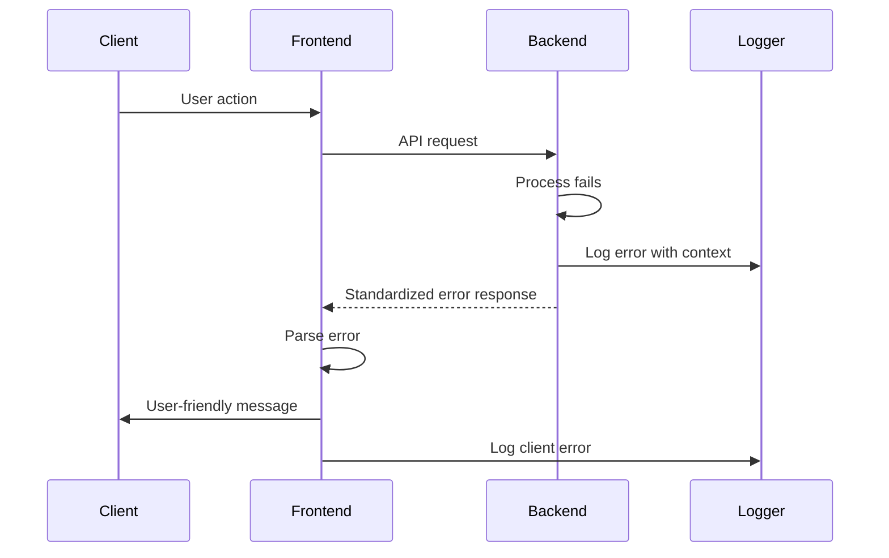

# Error Handling Strategy

## Error Flow


## Error Response Format
```typescript
interface ApiError {
  error: {
    code: string;        // TASK_NOT_FOUND
    message: string;     // Human-readable message
    details?: {          // Additional context
      field?: string;
      validation?: string[];
    };
    timestamp: string;
    requestId: string;
  };
}
```

## Frontend Error Handling
```typescript
// lib/api/errorHandler.ts
export class ApiErrorHandler {
  static handle(error: AxiosError<ApiError>) {
    if (error.response?.data?.error) {
      const apiError = error.response.data.error;
      
      switch (apiError.code) {
        case 'UNAUTHORIZED':
          router.push('/login');
          break;
        case 'SUBSCRIPTION_REQUIRED':
          toast.error('Upgrade your plan to access this feature');
          break;
        default:
          toast.error(apiError.message);
      }
    } else {
      toast.error('An unexpected error occurred');
    }
    
    // Log to monitoring service
    logger.error('API Error', {
      ...apiError,
      url: error.config?.url,
    });
  }
}
```

## Backend Error Handling
```php
<?php

namespace App\Exceptions;

use Illuminate\Foundation\Exceptions\Handler as ExceptionHandler;
use Illuminate\Validation\ValidationException;
use Symfony\Component\HttpKernel\Exception\NotFoundHttpException;

class Handler extends ExceptionHandler
{
    public function register()
    {
        $this->renderable(function (NotFoundHttpException $e, $request) {
            if ($request->expectsJson()) {
                return response()->json([
                    'error' => [
                        'code' => 'RESOURCE_NOT_FOUND',
                        'message' => 'The requested resource was not found',
                        'timestamp' => now()->toIso8601String(),
                        'requestId' => request()->header('X-Request-ID'),
                    ],
                ], 404);
            }
        });
        
        $this->renderable(function (ValidationException $e, $request) {
            if ($request->expectsJson()) {
                return response()->json([
                    'error' => [
                        'code' => 'VALIDATION_ERROR',
                        'message' => 'The given data was invalid',
                        'details' => $e->errors(),
                        'timestamp' => now()->toIso8601String(),
                        'requestId' => request()->header('X-Request-ID'),
                    ],
                ], 422);
            }
        });
    }
}
```

---
