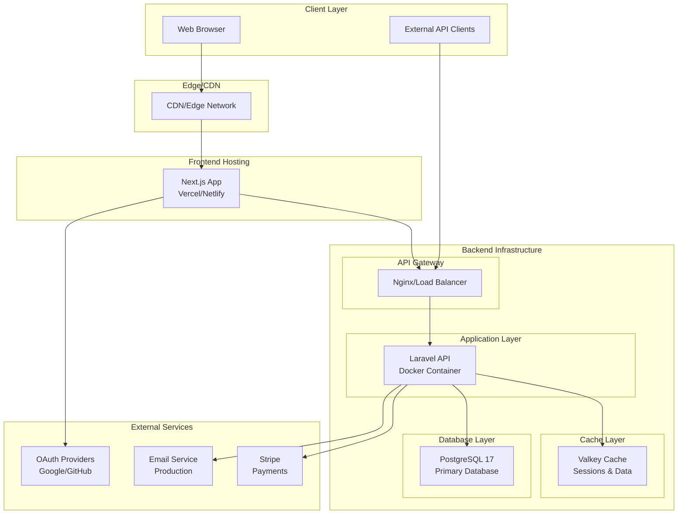

# High Level Architecture

## Technical Summary

TaskFlow Pro implements a **modular monolith architecture** deployed as containerized services, with Laravel 12.x serving as a RESTful API backend and Next.js 15 providing a server-side rendered SPA frontend. The system integrates via session-based authentication for the SPA and API key authentication for external access, utilizing PostgreSQL 17 for persistent storage and Valkey 7.x for caching. Infrastructure leverages Docker via Laravel Sail for development consistency, with production deployment options including AWS ECS, Vercel, or DigitalOcean App Platform. This architecture achieves the PRD goals of building a production-ready multi-tenant SaaS with comprehensive authentication, subscription billing via Stripe, and scalable task management capabilities.

## Platform and Infrastructure Choice

**Platform:** Development via Docker/Laravel Sail, Production flexible (AWS/GCP/DigitalOcean)  
**Key Services:** 
- PostgreSQL 17 (managed database)
- Valkey 7.x (Redis-compatible cache) 
- Stripe (payment processing)
- Mailpit (development email testing)
- GitHub Actions (CI/CD)

**Deployment Host and Regions:** 
- Backend: Containerized deployment (AWS ECS, Google Cloud Run, or DigitalOcean App Platform)
- Frontend: Edge deployment via Vercel or Netlify
- Initial region: US-East with CDN distribution

## Repository Structure

**Structure:** Monorepo with unified tooling  
**Monorepo Tool:** npm/yarn workspaces (native, no additional tooling required)  
**Package Organization:** 
- `/backend` - Laravel API application
- `/frontend` - Next.js SPA application  
- `/docs` - Shared documentation
- Root-level configuration for CI/CD and development scripts

## High Level Architecture Diagram

## Architectural Patterns

- **Modular Monolith Architecture:** Single Laravel application with domain-separated modules - _Rationale:_ Simpler deployment and debugging while learning, can evolve to microservices later
- **API-First Design:** Complete separation of API and frontend - _Rationale:_ Enables multiple client types and promotes clean architecture boundaries  
- **Repository Pattern:** Abstract database operations behind repositories - _Rationale:_ Testability and potential for future database migration
- **Component-Based UI:** Reusable React components with Shadcn/ui - _Rationale:_ Consistency and rapid development with pre-built accessible components
- **Server-Side Rendering (SSR):** Next.js App Router for optimal performance - _Rationale:_ Better SEO, faster initial loads, and improved Core Web Vitals
- **Session + API Key Auth:** Dual authentication strategy - _Rationale:_ Optimal UX for SPA while enabling external integrations
- **Event-Driven Updates:** Laravel Events for domain events - _Rationale:_ Decoupled modules and future webhook/real-time capabilities
- **Cache-Aside Pattern:** Valkey for query result caching - _Rationale:_ Reduced database load and sub-50ms response times

---
